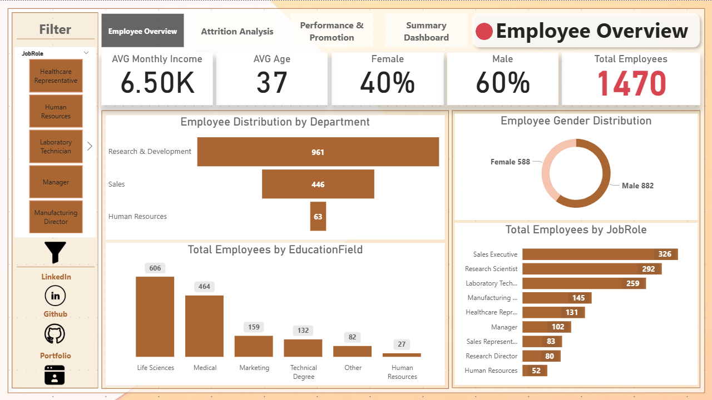
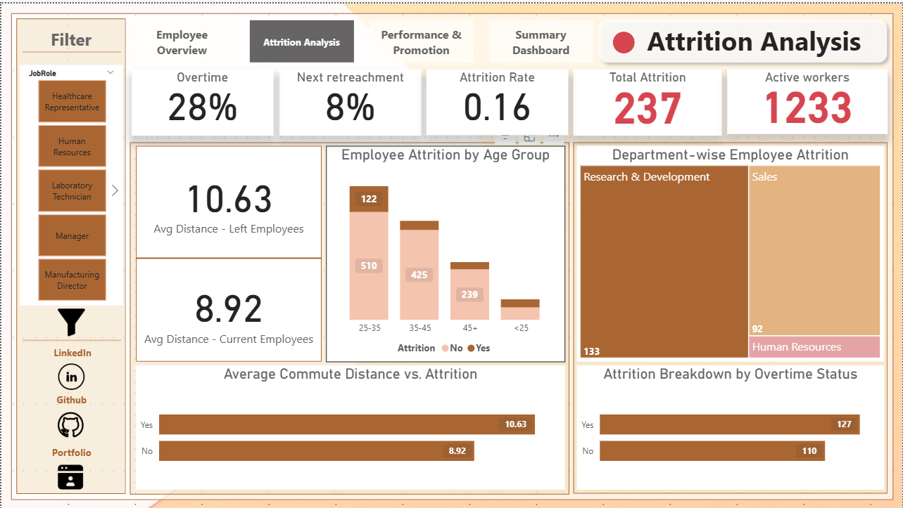
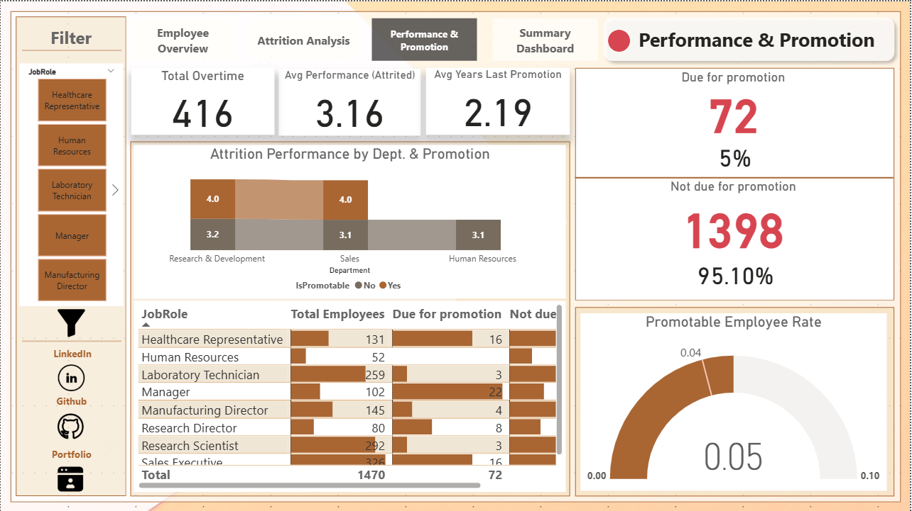
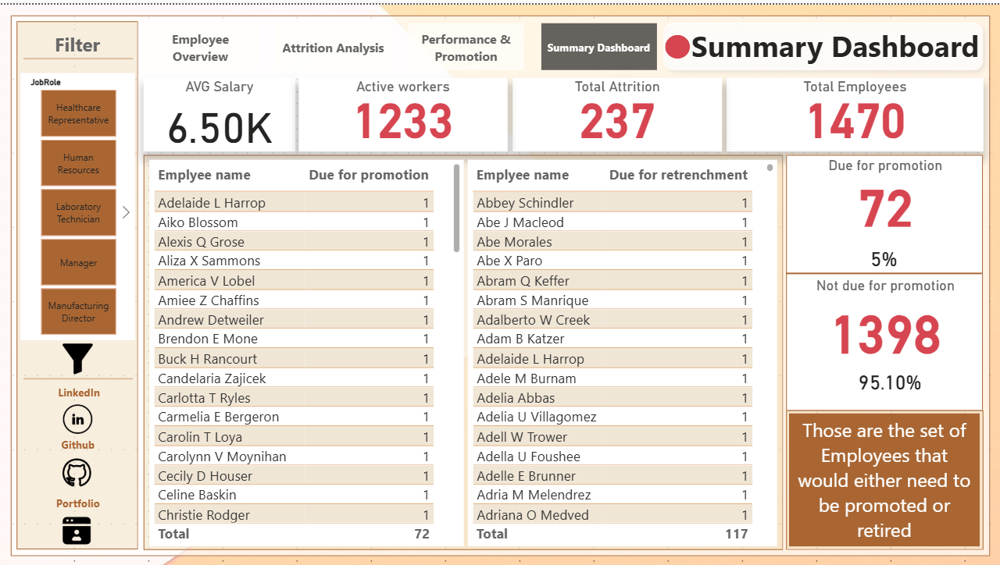

# HR Data Report 📊

This Power BI project provides interactive insights into employee attrition and retrenchment trends, helping HR teams make data-driven decisions regarding talent retention and performance.

---

## 📌 Key Features

- Department-wise average performance of retrenched employees
- Insights into promotability and its link with attrition
- Visual KPIs: Attrition rates, performance scores, promotion eligibility
- Clear filters and slicers using image-based buttons
-  indicators showing promotable employee rates

--

## 🔧 Tools Used
- **Power Query**
-To Transform data and make ETL process
-  **Excel**
- **Power BI Desktop**
- DAX measures and calculated fields
- Data model with relationships

---

## 🔗 Portfolio

You can view my full portfolio here:  
🌐 [sarahalimansi.wordpress.com](https://sarahalimansi.wordpress.com/)  
💻 [github.com/saraalimansi](https://github.com/saraalimansi)

---
## 📸 Dashboard Previews

### 🔹 Employee Overview

### 🔹 Attrition Analysis

### 🔹 Perforamnce&Permotion

### 🔹 Summary Dashboard

---
## 🧑‍💼 Author

**Sarah Ali Mansy**  
Data Analyst | Power BI | SQL | Excel | Python  
📧 saraalimansi2@gmail.com  
